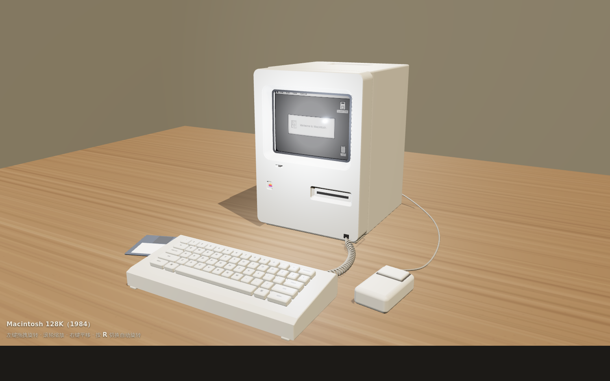

# Macintosh 128K · three.js 高精度模型

用 three.js 程序化建模的第一代 Macintosh（1984 年 Macintosh 128K），
无任何外部模型文件——所有几何体、贴图均由代码实时生成。



## 运行

three.js 已随仓库内置于 `vendor/`（v0.160.0），无需联网、无需构建，
但 ES Module 需要通过 HTTP 访问：

```bash
cd macintosh-128k
python3 -m http.server 8000
# 浏览器打开 http://localhost:8000
```

操作：左键拖拽旋转 · 滚轮缩放 · 右键平移 · 按 `R` 切换自动旋转 ·
按 `E` 将设备组（主机+键盘+鼠标+线缆+软盘）导出为 `macintosh-128k.glb`
（glTF 2.0 二进制，含 PBR 清漆 / 自发光扩展，可导入 Blender 等 3D 软件）。
支持 `?cam=x,y,z&tgt=x,y,z` URL 参数指定机位（便于截图）。

## 真实感 / 物理正确性

- **真实尺寸（米制）**：主机 0.244 × 0.345 × 0.278 m，M0110 键盘、
  M0100 单键鼠标、400K 软盘均按实物比例；
- **物理光照单位**：three.js 物理光照模式（`useLegacyLights = false`，
  点光/聚光按坎德拉、平方反比衰减），ACES Filmic 色调映射；
- **PBR 材质**：`MeshPhysicalMaterial` 清漆层模拟 ABS 塑料与 CRT 玻璃，
  PMREM RoomEnvironment 提供基于图像的环境反射；
- **阴影**：2048² PCF 软阴影（主光）+ 墙面反弹背光 + 半球环境光；
- **CRT**：曲面凸起玻璃、自发光 System 1 桌面画面（Canvas 程序绘制的
  菜单栏 / 欢迎对话框 / Happy Mac / 磁盘与废纸篓图标、扫描线、暗角、
  刷新率微闪烁），并以微弱点光把屏幕辉光真实地投到桌面上。

## 建模细节

- 前面板：带孔洞的圆角倒角挤出（`ExtrudeGeometry` + holes），
  屏幕 / 软驱 / 徽标 / 亮度轮四处开孔均为真实凹陷（放样斜壁）；
- 六色苹果徽标（Canvas 绘制剪影 + 条纹）、亮度调节滚轮、400K 软驱插缝；
- 后桶身垂直挤出成型，顶部提手为真实凹槽 + 抓握横梁；
- 背部散热缝阵列、接口区、电源开关；机身前后件之间有真实接缝；
- M0110 键盘：楔形壳体、59 键完整布局（含 ⌘ 键）、逐键字符贴图、
  盘绕螺旋键盘线（沿 Frenet 标架生成螺旋管）；
- M0100 鼠标：单键 + 接缝、绕过机身右侧的鼠标线；
- 桌面为程序生成木纹，配墙面与地面构成简单房间。

## 文件

| 文件 | 说明 |
| --- | --- |
| `index.html` | 页面入口（importmap 指向本地 vendor） |
| `main.js` | 全部建模、材质、光照与交互逻辑 |
| `vendor/` | three.js v0.160.0 及 OrbitControls / RoundedBoxGeometry / RoomEnvironment |
